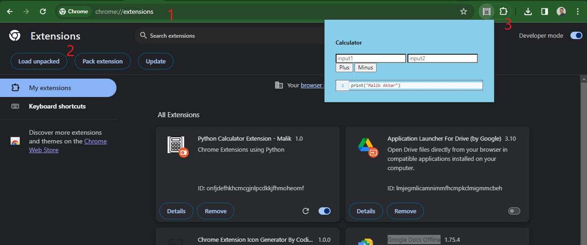

# Python Web Extension - Calculator

> This project contains a chrome extension for calculating simple addition and substraction number using Python. This project also provide REPL for user to play with Python script in the web extension

## How to Setup
All you need to do is load this project in chrome extensions

1. Open your Google Chrome browser and go to `chrome://extensions/`
2. Click `Load unpacked` and select this folder
3. Open the extension and use it!

You can also see the visualization on the Screenshots section

## Tech Stacks
This project uses PyScript and all its runtime dependencies (Pyodides) locally to run Chrome extension using Python

## Screenshots
### How to Setup

## **CREDITS**

A big "Thank You" to https://github.com/PFython/pyscript-local-runtime for the project template.
